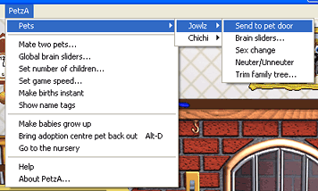
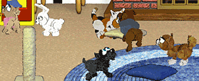

# PetzA


PetzA is an add-on for Petz 2, 3, 4, 5 and Babyz that gives you tons of cool new features and even fixes 
bugs in the game. PetzA appears as a new menu item at the top of your Petz or Babyz game. 

## Features
- Babyz and Petz - take out an unlimited number of Petz and Babyz at once! Just keep clicking the "Pick a pet" button to bring out more.
- Reduce the size of oversized petfiles with the family tree trimmer
- Instant mating of petz, have your babies grow up instantly!
- Choose the size of your Petz 5 litters
- Add new playscenes to the Babyz house
- Stop your Babyz from soiling their diapers!
- Fixes Babyz and Petz 3 sound lockups on Windows XP and Vista
- Change the speed of your game
- Brainsliders for your petz/babyz - control their age, fatness, etc.
- Neuter/unneuter and change the sex of your petz
- Organise your Petz into profiles
- Take GIF and PNG format pictures with the camera
- And more!

## Supported versions

- Petz 2 (English, the demo .exe)
- Petz 3 (English)
- Petz 3 (German)
- Petz 4.2 (English)
- Petz 5 (English)
- Babyz (English)

If have a version which is slightly different than what is required (e.g. you have the Petz program 
from the Catz CD, but PetzA requires the Petz program from the Dogz CD), then PetzA will automatically 
download and install the new version for you. 

Please note! PetzA does not support non-English versions of Petz 5 or Petz 4. Allowing PetzA to auto-update
these versions during install will stop them from working. To repair them, you can restore the backup that
PetzA makes of the Petz exe.


## Download and install
You can grab a copy of the PetzA installer now [from the Releases tab](https://github.com/thenickdude/PetzA/releases/).

## Known issues
#### General
In some games, you may find that the game will crash if you're taking snapshots and choose "Take other 
petz/babyz photo" with more than 4 petz/babyz in the scene.
#### Petz 5
Remember that the brain-sliders are dangerous to use for "growing-up" only some of a litter of babies who 
are still part of their mother. Use the sliders on babies at your own risk; if you corrupt the mother's 
file and lose the babies, nobody can fix it.
#### Petz 2 
If you click on the "bring out" name of an already-out pet, the game will crash.

Remember that this is still in development, treat it as you would any beta-test software. Use at your own 
risk and remember to always, always, ALWAYS store backup copies of your precious files somewhere safe. I 
repeat -- make sure you back up precious .pet files and .baby files. 

Unfortunately, PetzA cannot support Catz 1, Dogz 1 or Oddballz, as these programs are in a different, 
incompatible format. 

## Building PetzA from sourcecode

PetzA was originally developed way back in 2005 using Delphi 5 (wow, time flies!). I've upgraded the 
codebase so that it is now compatible with the 18-year newer [Embarcadero Delphi 10.2 (Tokyo) Community Edition](https://www.embarcadero.com/delphi-xe8-starter-edition).

Building the help manual requires Help'n'Doc 5 or newer: https://www.helpndoc.com/

Building the installer requires:
- InnoSetup 5 Unicode: http://www.jrsoftware.org/isdl.php
- InnoTools Downloader: https://github.com/thenickdude/InnoTools-Downloader

Building PetzA requires:
- The madCollection, including madExcept 4 (Delphi plugin): http://www.madshi.net/

Fetch the PetzA sourecode along with its libraries like so:

```bash
# Fetch PetzA:
git clone https://github.com/thenickdude/PetzA.git

# Fetch its dependencies:
cd PetzA
git submodule update --init
```

Then you can open PetzA.dproj to build just the "build\PetzA.toy" library. Or if you open up the "RAD Studio Command
Prompt" app, you can automatically build everything (helpfile, libraries, installer) by running "make" in the main directory.

## Live debugging

You can debug PetzA while it's running inside Petz. Switch to the "test" release configuration by double-clicking that in
the Project Manager pane. Select Project -> Options -> Delphi Compiler. Update the Output Directory to point to your Petz
game's Resource\Toyz directory. In Project -> Options -> Debugger, set the Host Application to the Petz .exe for your Petz
installation (e.g. Petz 5.exe). Now when you click the Run button, Petz should be launched and breakpoints in PetzA will be
active.